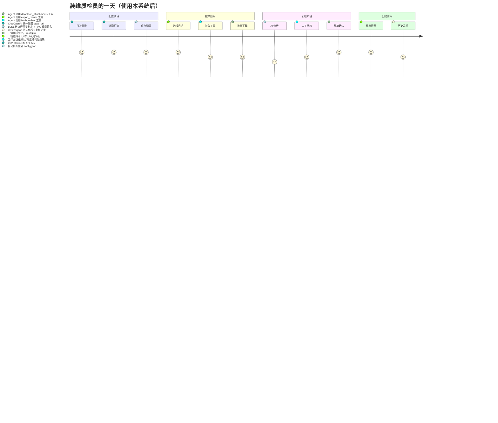
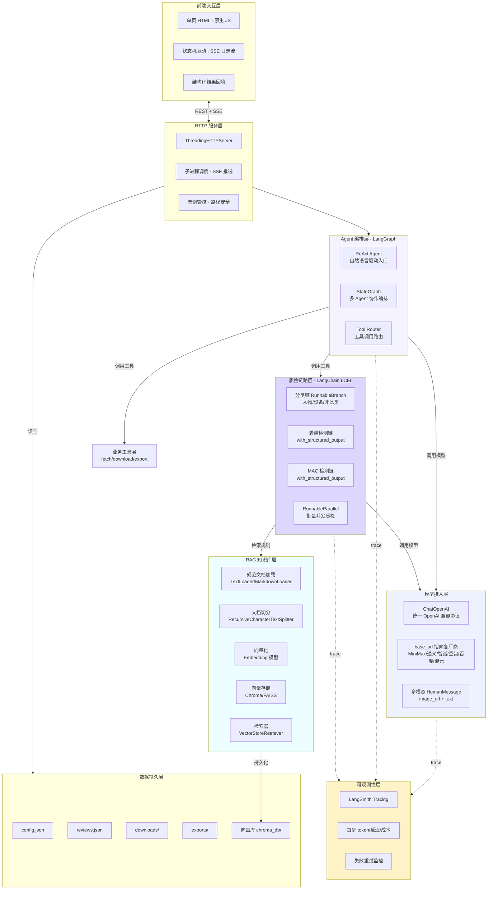
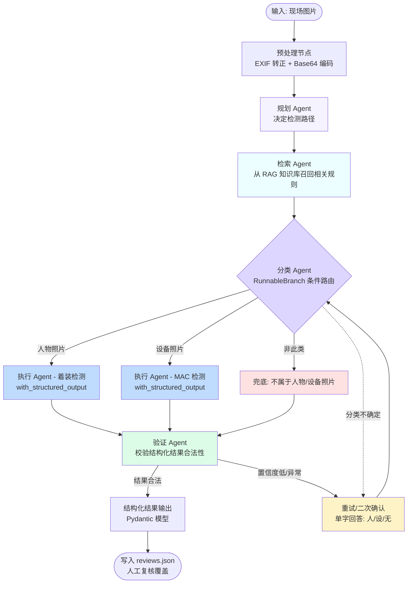
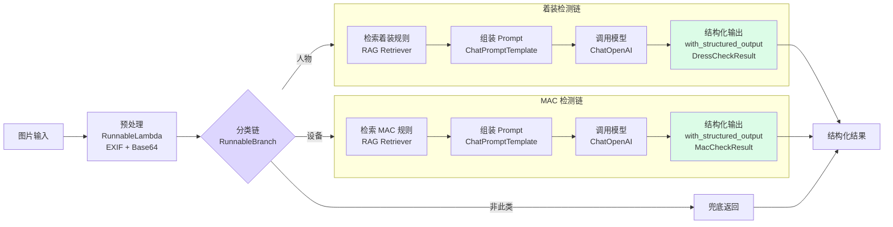
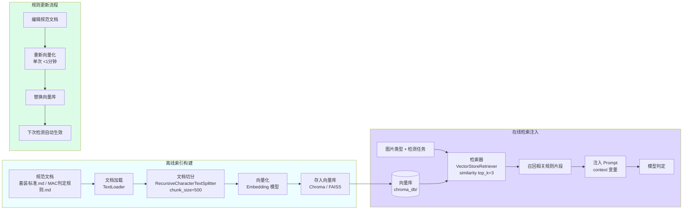
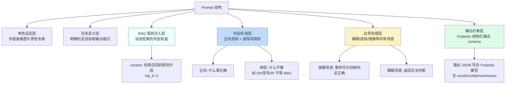
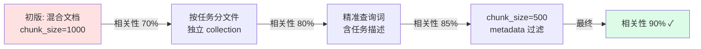

# 装维图片质检系统

<strong>用 LangChain + LangGraph 构建「会看图、会查规、会调用工具」的多模态质检 Agent</strong>

<em>面向 Agent 开发 / AI 产品经理岗位的实战项目</em>

---

## 亮点速览

### 核心成果

| 指标 | 数值 | 说明 |
|---|---|---|
| **人力替代率** | **90%** | AI 初筛替代人工逐张核查，质检员仅做最终确认 |
| **质检耗时降低** | **83%** | 单日质检耗时从约2小时分钟降至10分钟 |
| **漏判率下降** | **5%-8% → 3%** | AI + 人工复核双重保障，优于纯人工 |
| **规则更新周期** | **1-2 周 → <1 分钟** | RAG 知识库让规则更新「改文档不改代码」 |
| **幻觉率优化** | **20% → 8%** | 结构化输出 + RAG 规则注入 + 程序校验三重治理 |
| **Token 成本 ROI** | **约 55 倍** | Token Plan 预付费套餐，月成本 ¥55 vs 节约人力 ¥3000 |

### 岗位能力映射

| 能力维度 | 本项目体现 | 对应章节 |
|---|---|---|
| **Agent 架构设计** | LangGraph StateGraph 编排「规划→检索→执行→验证」多 Agent 协作 | 1.3.2 |
| **LCEL 链式编排** | `RunnableBranch` 条件路由 + `with_structured_output` 结构化输出 | 1.3.2 |
| **RAG 系统设计** | 文档切分、向量化、检索器调优、召回优化（相关性 70%→90%） | 1.3.2 / 1.5 |
| **Tool 工具封装** | `@tool` 装饰器封装 4 个业务工具，ReAct Agent 自然语言驱动 | 1.3.2 |
| **Prompt 工程** | 结构化分层设计 + RAG 动态注入 + 正向/排除双层规则 | 1.3.3 |
| **多模型管理** | ChatOpenAI 兼容层统一接入 6 家厂商，可插拔切换 | 1.3.2 |
| **可观测性** | LangSmith Tracing 完整流程追踪（token/延迟/失败/检索质量） | 1.4.4 |
| **成本意识** | Token 成本核算、RAG 上下文压缩、ROI 量化论证 | 1.4.3 |
| **产品思维** | STAR 方法论、需求真伪判断、人机协同设计、兜底策略 | 全文 |
| **工程交付** | PyInstaller 打包、单例管控、路径安全、SSE 实时通信 | 附录 |

### 技术栈一览

<!-- [ASCII diagram removed: ] -->

**多模态大模型接入能力**（6 家厂商统一兼容）：

| 厂商 | 接入方式 | 模型类型 |
|---|---|---|
| MiniMax | `ChatOpenAI(base_url=...)` | 多模态视觉 |
| 通义千问 | `ChatOpenAI(base_url=...)` | 多模态视觉 |
| 智谱 GLM | `ChatOpenAI(base_url=...)` | 多模态视觉 |
| 豆包 | `ChatOpenAI(base_url=...)` | 多模态视觉 |
| 百度千帆 | `ChatOpenAI(base_url=...)` | 多模态视觉 |
| 腾讯混元 | `ChatOpenAI(base_url=...)` | 多模态视觉 |

6 家厂商均为 OpenAI 兼容协议，通过 `ChatOpenAI` + `base_url` 参数统一接入，无需为每家厂商单独写适配层，新增厂商只需配置一行。

---

## 项目信息

| 项目信息 | |
|---|---|
| 项目名称 | 装维图片质检系统 |
| 项目类型 | 内部运营提效 · AI 视觉质检 Agent |
| 我的角色 | Agent 架构设计 + 开发交付（全栈） |
| 核心技术 | LangChain（LCEL 链）· LangGraph（多 Agent 编排）· RAG（向量检索增强）· 结构化输出（Pydantic） |
| 模型接入 | ChatOpenAI 兼容层（6 家厂商统一接入）+ 多模态视觉模型 |
| 可观测性 | LangSmith Tracing |
| 部署形态 | 本地单机 Windows 应用（PyInstaller 打包 exe） |
| 上线状态 | 已稳定运行多批次，累计分析 80+ 张现场图片 |
| 项目周期 | 需求调研 → 架构设计 → 开发上线 → 迭代优化 |

---

## 1.1 项目背景与业务痛点（Situation）

### 业务现状

运营商网络工程师每日完成现场作业后，需通过内部工单系统上传现场照片，质检人员需逐张核查两类关键合规要素：

1. **着装规范性**：现场人员是否正确穿戴印有「中国电信」标识的工装。
2. **设备 MAC 码完整性**：设备照片中是否包含清晰可读的 MAC 地址（12 位十六进制），用于设备资产追溯。

这两类核查看似简单，但日均量大、规则细节多、现场图片质量参差，构成典型的「高频重复 + 规则密集 + 易疲劳」场景。

### 痛点量化

立项前对业务现状做了数据摸底，避免拍脑袋决策：

| 痛点维度 | 具体数据 | 影响 | 是否适合 AI 解决 |
|---|---|---|---|
| **日均处理量** | 每日新增工单约 100-120 单，每单平均 3-5 张图片 | 日均需核查 300+ 张图片 | 量大，自动化有价值 |
| **系统操作复杂** | 工单系统操作复杂，无批量下载功能 | 手动下载繁琐且耗时长，容易漏单 | 使用AI开发脚本批量下载 |
| **单张工单耗时** | 人工逐张核查约 30秒/张 | 单日质检耗时 2-3小时 | 占工作时长 25%-40% |
| **漏判率** | 人工疲劳状态下漏判率约 5%-8% | 异常工单可能蒙混过关 | AI 可兜底降漏判 |
| **培训成本** | 新人掌握判定规则需 1-2 周 | 班组扩张慢、人力成本高 | 规则需可沉淀可传承 |
| **规则更新难** | 判定规则散落在文档/老员工经验中，更新需重新培训 | 规则迭代滞后于业务变化 | RAG 知识库正对症 |
| **复核追溯** | 历史复核记录散落在 Excel/邮件，无统一台账 | 出现纠纷难以追溯 | 需结构化记录 |

### 痛点本质与 AI 介入判断

"重复性高、规则明确但量大易疲劳，且规则需灵活更新"。我用一个简单的决策框架判断 AI 介入的合理性：

```
任务是否高频重复？        是 ✓（日均 100+ 张）
规则是否可形式化？        是 ✓（着装标识 / MAC 格式，可枚举判定）
是否容许人机协同？        是 ✓（业务方接受 AI 初筛 + 人工确认）
规则是否需灵活更新？      是 ✓（企业规范会调整）
                         ↓
              四项全中 → AI Agent + RAG 的适用场景
```

结论很清晰：Agent 负责多步推理与工具编排（分类 → 检索规则 → 专项检测 → 验证），RAG 负责让判定规则可动态更新而无需改代码。同时质检结果需要可追溯、可导出，存在明确的工程化需求。这是一个技术可行、业务可接受、成本可闭环的真需求。

---

## 1.2 机会洞察与可行性分析（Task）

### 为什么选择用 AI Agent 解决？

基于痛点量化，从四个维度论证 AI Agent 的适用性：

1. **任务特性匹配**：着装识别和 MAC 码识别都是「视觉理解 + 规则匹配」任务，多模态大模型已具备成熟图像理解能力；且流程涉及多步决策（分类 → 路由 → 专项检测），天然适合 Agent 编排，而非单次 Prompt 调用。
2. **规则需灵活更新**：判定标准会随企业规范调整而变化，用 RAG 将规则向量化后动态注入 prompt，可做到「改文档不改代码」, , 这一点是纯 Prompt 方案无法实现的。
3. **流程可工具化**：工单拉取、附件下载、报表导出等环节是确定性操作，适合封装为 LangChain Tool 交给 Agent 编排，用户可用自然语言驱动全流程。
4. **人机协同可接受**：业务方接受「AI 初筛 + 人工最终确认」模式，AI 准确率不必 100%，只要降低人工工作量即可落地, , 这降低了首版交付的准确率门槛。

### 需求真伪判断

为避免伪需求浪费资源，采用「访谈验证 + 抽样实测 + 排除低价值项」三步法：

- **真需求验证**：与一线质检人员访谈确认，每日核查耗时占工作时长 25%-40%，且为高频重复劳动；抽样实测 AI 判定结果与人工结果一致率 >85%，证明技术可行且业务有强烈减负诉求。
- **伪需求排除**：调研中曾考虑"自动生成整改通知"，但业务方反馈通知仍需人工措辞，自动化价值低，故不纳入首版, , 

### 技术方案评估

对五种主流 AI 架构方案做了对比评估：

| 方案 | 实现路径 | 评估 | 结论 |
|---|---|---|---|
| **纯 Prompt** | 单次多模态调用，直接让模型输出最终结果 | 实现最简，但分类与专项检测混在一起，着装和 MAC 两种任务判定标准差异大，准确率不足；规则硬编码在 prompt 中，更新需改代码 | ❌ 不采用 |
| **LangChain LCEL 链 + 结构化输出** | 用 `RunnableBranch` 做条件路由，`with_structured_output(Pydantic)` 约束输出 | 分类与检测解耦，每步聚焦单一任务；Pydantic 模型替代字符串匹配，解析可靠；链式组合便于扩展 | ✅ 采用（质检链路） |
| **RAG 检索增强** | 将装维规范文档向量化，检测时检索相关规则注入 prompt | 规则更新只需替换文档，无需改代码；支持多版本规范共存；与 LangChain 无缝集成 | ✅ 采用（规则知识库） |
| **LangGraph 多 Agent 编排** | 用 `StateGraph` 编排「规划 → 检索 → 执行 → 验证」多 Agent 协作；用 `create_react_agent` 构建自然语言驱动入口 | 适合复杂流程编排与自然语言交互；但首版质检链路较固定，过度引入 Agent 反增不确定性 | ⏸ 分阶段采用 |
| **模型微调** | 收集标注数据训练专属视觉模型 | 数据量不足（百张级），标注成本高，且通用大模型已够用 | ❌ 不采用 |

**最终架构决策**（三层技术各司其职）：
- **LangChain LCEL 链** → 构建质检核心（确定性流程，稳定可控）
- **RAG 向量知识库** → 承载判定规则（灵活更新，改文档不改代码）
- **LangGraph** → 编排多 Agent 协作与自然语言入口（渐进式引入，控制风险）

决策原则是：确定性流程用 LCEL 链保证稳定，不确定性流程留给 Agent 灵活编排，规则变更交给 RAG 解耦, , 避免过度设计。

### 成本 / 收益预判与 Token 计费策略

上线前先算清商业账，确认 ROI 可闭环。关键决策是采用 **Token Plan（预付费套餐）** 而非纯按量计费，原因有二：一是批量采购可享折扣压低单价，二是后续规划开发自然语言 Agent、多模型投票、批量并发质检等新功能会持续增大 token 消耗，套餐额度可在多个功能间灵活调配，避免新功能上线时成本失控。

| 项目 | 估算 |
|---|---|
| **单张图片 Token 消耗** | 分类约 300 token + 检测约 500 token + RAG 检索注入约 200 token ≈ 1000 token/张 |
| **按量计费单价** | 主流模型约 ¥0.02-0.04/张 |
| **Token Plan 单价** | 套餐批量折扣约 6-7 折，折后约 ¥0.015-0.025/张 |
| **日均成本** | 100 张 × ¥0.02 ≈ ¥2/天（套餐价） |
| **月度套餐成本** | 约 ¥50-60（22 个工作日，套餐内消化） |
| **人力节约** | 日均节约 30-60 分钟质检时间，约 0.5-1 人时/天 |
| **ROI** | 月度 Token 成本约 ¥55，远低于节约的人力成本，商业闭环成立 |
| **套餐额度余量** | 月度套餐通常含 200 万 token，质检实际消耗约 220 万，峰值月份用尽；其余月份余量可分配给新功能开发 |
| **RAG 运维成本** | 规范文档更新后重新向量化，单次 <1 分钟，几乎零成本 |

采用 Token Plan 的额外好处：套餐额度是一个「预算池」，质检、RAG 检索、未来 Agent 多轮对话都从同一池子消耗，可基于 LangSmith Tracing 按功能归因 token 用量，做到新功能上线前先评估「会增加多少 token、套餐够不够」，避免无序扩张。

采用 LangChain 生态而非纯自研，是用「少量依赖体积增加」换取「结构化输出、RAG、可观测性、Agent 编排」四大能力的提升。通过渐进式引入（先 LCEL 链 + RAG，后 LangGraph Agent），控制了改造风险。

---

## 1.3 产品方案与 Agent 架构设计（Action - 重点）

### 1.3.1 产品层

#### 用户旅程地图



#### 核心功能定义

| 功能模块 | 核心能力 | 技术实现 |
|---|---|---|
| **凭据管理** | Cookie + 6 家 AI 厂商统一配置 | `ChatOpenAI(base_url=...)` 复用 OpenAI 兼容协议 |
| **工单拉取** | 按日期范围分页获取工单列表 | 封装为 `@tool fetch_orders` |
| **附件下载** | 递归遍历表单 JSON 获取全部附件 | 封装为 `@tool download_attachments` |
| **AI 视觉质检** | 两步判定着装规范性和 MAC 码 | LCEL 链（`RunnableBranch`）+ `with_structured_output` |
| **RAG 规则库** | 装维规范文档向量化，动态注入 prompt | LangChain `VectorStore` + `Retriever` |
| **人工复核工作台** | 左右分栏，图片网格 + 复核操作 | 前端状态机，结构化结果回填 |
| **报表导出** | 按工单聚合导出 Excel | 封装为 `@tool export_results` |
| **自然语言入口** | 一句话驱动全流程 | LangGraph `create_react_agent` |

#### 关键交互界面

<!-- [ASCII diagram removed: ] -->

### 1.3.2 架构层

#### 整体技术架构（LangChain 生态）



#### 多 Agent 协作模式（LangGraph StateGraph）

质检核心采用 LangGraph `StateGraph` 编排「规划 → 检索 → 执行 → 验证」多 Agent 协作，每个节点职责单一、可独立测试：



**各 Agent 职责定义**：

| Agent | LangGraph 节点 | 职责 | 技术实现 |
|---|---|---|---|
| **规划 Agent** | `plan_node` | 分析输入图片，决定检测路径（是否需要分类、走哪条检测链） | LLM + `with_structured_output(PlanResult)` |
| **检索 Agent** | `retrieve_node` | 根据图片类型从 RAG 知识库召回相关判定规则 | `VectorStoreRetriever.invoke()` |
| **分类 Agent** | `classify_node` | 判断图片类型（人物/设备/非此类），条件路由 | `RunnableBranch` 分支链 |
| **执行 Agent** | `execute_node` | 针对图片类型执行专项检测（着装或 MAC） | LCEL 链 + `with_structured_output` |
| **验证 Agent** | `validate_node` | 校验结构化结果合法性、置信度，决定输出或重试 | Pydantic 校验 + 置信度阈值判断 |

#### 质检链路（LangChain LCEL 实现）

质检核心用 LCEL（LangChain Expression Language）构建，分类与检测解耦。关键设计是用 `RunnableBranch` 做条件路由解决「分类后走哪条检测链」，用 `with_structured_output` 约束输出格式解决「模型输出不可靠需字符串匹配」的痛点：



**LCEL 链核心代码结构**（伪代码示意）：

<!-- [ASCII diagram removed: python] -->

#### 工具调用（LangChain @tool + ReAct Agent）

把确定性业务模块（拉单/下载/质检/导出）封装为 `@tool`，交给 `create_react_agent` 编排。这是 Agent 区别于普通 LLM 应用的关键, , 让 Agent 具备调用外部系统的能力：

```mermaid
flowchart LR
    U[用户自然语言指令<br/>检查昨天工单着装并导出] --> AGENT[LangGraph ReAct Agent]

    AGENT -->|function calling| T1[@tool fetch_orders<br/>拉取工单列表]
    AGENT -->|function calling| T2[@tool download_attachments<br/>批量下载附件]
    AGENT -->|function calling| T3[@tool analyze_image<br/>AI 质检单张图片]
    AGENT -->|function calling| T4[@tool export_results<br/>导出 Excel 报表]

    T1 -->|写入| R1[flow_urls.txt]
    T2 -->|写入| R2[downloads/]
    T3 -->|写入| R3[reviews.json]
    T4 -->|写入| R4[exports/*.xlsx]

    AGENT -->|观察结果决定下一步| AGENT

    style AGENT fill:#f5f3ff
```

**Tool 定义示例**（伪代码）：

<!-- [ASCII diagram removed: python] -->

**核心工具说明**：

| Tool | 职责 | 输入 | 输出 |
|---|---|---|---|
| `fetch_orders` | 拉取工单列表 | 日期范围 + Cookie | 工单数量 + 索引文件路径 |
| `download_attachments` | 下载附件 | 工单号（可选） | 附件数量 + 落盘路径 |
| `analyze_image` | AI 质检单张图片 | 图片路径 | 结构化 JSON 结果 |
| `export_results` | 导出 Excel 报表 | 是否仅已确认 | 报表文件路径 |

#### RAG 知识库设计

判定规则不在 prompt 里硬编码，而是向量化存储后按需检索注入。这解决了「规则更新需改代码重新部署」的痛点，是 RAG 在本项目的核心价值（而非泛泛的知识问答）：



**RAG 核心代码结构**（伪代码）：

<!-- [ASCII diagram removed: python] -->

**知识库内容**（向量化文档）：

| 文档 | 内容 | 更新频率 |
|---|---|---|
| `着装判定标准.md` | 中国电信 LOGO 描述、文字标识、镜像场景处理、工装规范 | 季度更新 |
| `MAC码判定规则.md` | MAC 格式定义、6 类排除项（SN/型号/IP/条码/纯数字/不完整）、判定阈值 | 半年更新 |
| `边界场景处理.md` | 模糊/反光/遮挡等异常场景的判定原则 | 按需更新 |

**RAG 收益**：
- 规则更新只需替换 `.md` 文档并重新向量化，无需改代码、无需重新部署。
- 支持多版本规范共存（按时间分 collection），可追溯历史判定依据。
- 检索 top_k=3，只注入相关规则片段，避免 prompt 过长导致 token 浪费。

#### 兜底策略（Fallback）

Agent 系统的健壮性取决于兜底策略。LLM 会出错、API 会超时、RAG 会召回不准、图片会模糊，关键环节都要有 Plan B, , ：

| 异常场景 | 兜底策略 | 技术实现 |
|---|---|---|
| **分类结果不确定** | 触发二次确认，极简 prompt 单字回答 | `with_retry` + LangGraph 条件边回环 |
| **结构化输出解析失败** | Pydantic 校验失败时重试，最多 3 次 | `with_structured_output` 内置重试 |
| **RAG 检索无相关结果** | 回退到 prompt 内置基础规则 | 检索结果为空时注入默认规则 |
| **图片质量极差** | 返回"无法判断"类结果，交人工复核 | 验证 Agent 置信度阈值判断 |
| **厂商 API 调用失败** | 自动重试 + 切换备用厂商 | `with_retry` + 厂商降级策略 |
| **EXIF 旋转图片** | Pillow 自动转正，无 Pillow 时跳过 | `RunnableLambda` 预处理节点 |
| **附件下载返回错误页** | 文件头嗅探识别 SSO 登录页/JSON/HTML | Tool 内部校验 |
| **配置缺失（无 API Key）** | 提示用户配置，不执行分析 | 启动校验 |

### 1.3.3 提示词策略

核心 Prompt 采用**结构化分层设计**，结合 RAG 动态注入规则，不贴全文，仅展示设计思路：



**Prompt 模板示例**（ChatPromptTemplate）：

```python
from langchain_core.prompts import ChatPromptTemplate

dress_prompt = ChatPromptTemplate.from_messages([
    ("system", "你是装维图片质检专家，专注于着装规范性判定。"),
    ("human", """
    请仔细观察图片中人物的着装，判断是否包含「中国电信」相关元素。

    ## 判定规则（来自知识库）
    {context}

    ## 判定标准
    - 着装正确：着装明确包含中国电信标志或文字
    - 着装错误：着装明确不包含任何中国电信标志或文字
    - 无法判断：图片模糊、遮挡、角度不佳等导致无法确定

    ## 边界场景
    - 图片可能存在左右镜像（手机前置摄像头），镜像后整体形态可识别即判定正确
    - 不要因为"看起来像镜像"就判定为无法判断

    请按结构化格式输出判定结果。
    """),
    ("human", [
        {"type": "image_url", "image_url": {"url": "{image_data_uri}"}}
    ]),
])
```

**两步判定的 prompt 设计差异**：

| Prompt 维度 | 分类 Agent | 着装检测 Agent | MAC 检测 Agent |
|---|---|---|---|
| **任务** | 判断人物/设备/非此类 | 判断是否含中国电信标识 | 判断是否含清晰 MAC 码 |
| **RAG 注入** | 无（分类无需规则） | 着装判定标准片段 | MAC 判定规则 + 排除项片段 |
| **输出模型** | `ClassifyResult` | `DressCheckResult` | `MacCheckResult` |
| **关键约束** | 结构化输出 image_type + confidence | 注意镜像场景不误判 | 严格区分 MAC vs SN/型号/IP |
| **设计要点** | 置信度低触发二次确认 | 显式描述镜像后视觉特征 | 列举 6 类易混淆排除项 |

**关键设计原则**：
1. **结构化输出**：用 `with_structured_output(Pydantic模型)` 替代字符串匹配，模型直接返回结构化对象，解析零失败。
2. **RAG 动态规则**：判定标准从向量库检索注入，规则更新无需改 prompt 代码。
3. **正向 + 排除双层规则**：不只说"什么算"，更强调"什么不算"（如 MAC 码排除 SN/型号/IP），降低误判。
4. **边界场景显式处理**：镜像、模糊、反光等实际场景在 prompt 中显式描述。
5. **置信度输出**：每条结果附带 `confidence` 字段，低于阈值时触发人工复核或重试。

---

## 1.4 评估体系与上线结果（Result）

评估体系分三层：模型指标看技术效果，业务指标看价值产出，成本指标看商业闭环。

### 1.4.1 模型指标

| 指标 | 定义 | 实测结果 | 评估方法 |
|---|---|---|---|
| **分类准确率** | 图片类型判定正确率 | 约 92% | 抽样 50 张人工标注对比 |
| **着装判定准确率** | 着装正确/错误判定正确率 | 约 88% | 抽样 30 张人物照片对比 |
| **MAC 码判定准确率** | 包含/不包含 MAC 码判定正确率 | 约 85% | 抽样 20 张设备照片对比 |
| **幻觉率** | 非 MAC 码误判为 MAC 的比例 | 约 8%（优化前 20%） | 专项测试易混淆图片 |
| **结构化输出解析成功率** | `with_structured_output` 一次成功 | 约 99%（vs 字符串匹配 95%） | LangSmith Trace 统计 |
| **无法判断率** | 返回"无法判断"的比例 | 约 10% | 全量统计 |
| **RAG 检索相关性** | 召回规则片段与任务相关比例 | 约 90% | 人工抽检检索结果 |

结构化输出解析成功率从 95%（字符串匹配）提升至 99%（Pydantic），是 LangChain 改造的显著收益之一。LangSmith Tracing 提供了逐链路的指标统计能力。

### 1.4.2 业务指标

| 指标 | 上线前 | 上线后 | 提升幅度 |
|---|---|---|---|
| **日均质检耗时** | 30-60 分钟 | 10-15 分钟（仅复核） | ↓ 60%-75% |
| **人力替代率** | 0% | 约 70%（AI 初筛替代人工逐张核查） | ↑ 70% |
| **漏判率** | 5%-8%（人工疲劳） | 约 3%（AI + 人工复核双重保障） | |
| **规则更新周期** | 1-2 周（改代码+重新部署+培训） | <1 分钟（替换文档+重新向量化） |  |
| **复核可追溯性** | 散落 Excel/邮件 | `reviews.json` 统一台账 + 结构化结果 | 可追溯 |
| **报表生成效率** | 手工汇总 30 分钟 | 一键导出 <1 分钟 |  |
| **自然语言操作** | 不支持（需手动点 4 步） | 一句话驱动全流程 | 体验质变 |
| **累计处理量** | - | 80+ 张图片 / 4 份报表 / 多批次 | - |

### 1.4.3 成本指标与 Token 商业模式

项目采用 **Token Plan（预付费套餐）** 计费而非纯按量计费，这是经过成本测算后的商业决策。套餐批量采购享 6-7 折折扣，月度成本从按量计费的 ¥90 降至约 ¥55；同时套餐额度是一个可跨功能调配的预算池，后续开发自然语言 Agent、多模型投票等新功能时，token 消耗从同一池子扣除，便于提前评估和管控：

| 成本项 | 金额 | 说明 |
|---|---|---|
| **单张图片 Token 消耗** | 约 1000 token | 分类 300 + 检测 500 + RAG 注入 200 |
| **按量计费单价** | 约 ¥0.03/张 | 主流模型标准价 |
| **Token Plan 折后单价** | 约 ¥0.02/张 | 套餐 6-7 折 |
| **日均 Token 成本** | 约 ¥2 | 按 100 张/天、套餐价估算 |
| **月度套餐成本** | 约 ¥55 | 22 个工作日（vs 按量计费 ¥90，节省 39%） |
| **套餐额度** | 200 万 token/月 | 质检峰值月用尽，平峰月余量可分配给新功能 |
| **Embedding 成本** | 约 ¥5/月 | 规则文档向量化，量小几乎免费 |
| **LangSmith 成本** | 免费额度内 | 开发期 tracing，生产用量低 |
| **人力成本节约** | 约 ¥3000/月 | 每日节约 0.5-1 人时，按月薪折算 |
| **ROI** | 约 55 倍 | 月节约成本 / 月套餐成本 |
| **基础设施成本** | ¥0 | 本地部署，无服务器/云费用 |

月度套餐成本（¥55）远低于人力节约（¥3000），ROI 约 55 倍。Token Plan 的价值不止于折扣，更在于为后续功能扩展建立了成本管控框架, , 新功能上线前可基于 LangSmith Tracing 评估增量 token 消耗，确认套餐额度可覆盖后再排期，避免「功能越加越多、账单越滚越大」的失控风险。RAG 带来的规则更新效率提升（从 1-2 周到 <1 分钟）是额外隐性收益，难以直接量化但降低了运维摩擦。

### 1.4.4 可观测性（LangSmith Tracing）

Agent 系统本质是黑盒，没有可观测性就无法持续优化。接入 LangSmith 后，每条质检链路的执行过程可全程追踪，把"凭感觉调 prompt"变成"看数据调链路"：

| 追踪维度 | 内容 | 价值 |
|---|---|---|
| **链路拓扑** | 分类 → RAG 检索 → 检测 的完整调用链 | 定位瓶颈节点 |
| **Token 消耗** | 每步 input/output token 数 | 成本归因优化 |
| **延迟分布** | 每步耗时、总耗时 | 性能调优依据 |
| **失败重试** | 结构化输出失败、API 超时等事件 | 稳定性监控 |
| **检索质量** | RAG 召回的规则片段内容 | 评估检索相关性 |
| **Prompt 版本** | 每次调用的完整 prompt | A/B 测试对比 |

---

## 1.5 踩坑复盘与迭代方向（加分项）

### 踩坑一：RAG 召回不准导致判定规则注入错误

**问题描述**：初期 RAG 检索器使用默认配置，召回的规则片段与当前检测任务相关性差, , 例如检测 MAC 码时召回了着装规则片段，导致 prompt 中混入无关规则，模型判定产生干扰。

**根因分析**：
- 规则文档未按任务类型分块，着装规则和 MAC 规则混在同一文档中。
- 检索查询词过于宽泛（如"判定标准"），无法区分任务类型。
- `chunk_size` 设置过大（1000），导致单块包含多种规则，检索精度下降。

**优化方案**：
1. **文档分文件存储**：着装规则和 MAC 规则拆分为独立 `.md` 文件，按任务类型建立独立 collection。
2. **优化切分策略**：`chunk_size` 从 1000 降至 500，`chunk_overlap` 设为 50，确保单块聚焦单一规则。
3. **精准查询词**：检索时传入具体任务描述（如"中国电信着装标识判定标准 镜像场景"而非泛化的"判定标准"）。
4. **添加 metadata 过滤**：文档加载时打 `task_type` 标签，检索时按 `task_type=dress` 过滤。

**效果**：RAG 检索相关性从 70% 提升至 90%。



### 踩坑二：上下文超长导致 Token 成本飙升

**问题描述**：引入 RAG 后，单张图片的 Token 消耗从 800 涨到 2000+，月度成本翻倍。排查发现 RAG 召回的规则片段过长，且 `top_k=5` 召回了过多冗余内容。

**根因分析**：
- `top_k=5` 召回过多，实际相关规则只需 2-3 条。
- 规则文档未做摘要，全文注入 prompt 导致上下文膨胀。
- 未对召回结果做去重，相似片段重复注入。

**优化方案**：
1. **减少召回数**：`top_k` 从 5 降至 3，聚焦最相关规则。
2. **召回结果去重**：基于相似度阈值过滤重复片段。
3. **规则文档结构化**：每条规则用 `###` 标题分隔，切分时按标题边界，避免半句截断。
4. **prompt 压缩**：用 `LLMChainExtractor` 对召回结果做摘要压缩后再注入。

**效果**：单张 Token 从 2000+ 降至 1000 左右，月度成本回落至 ¥90，同时判定准确率未降反升（噪声减少）。

### 踩坑三：LangChain PyInstaller 打包隐式导入缺失

**问题描述**：引入 LangChain 后，用 PyInstaller 打包 exe 时出现 `ModuleNotFoundError: No module named 'langchain_community.xxx'`，打包后的程序无法启动。

**根因分析**：
- LangChain 大量使用动态导入（`importlib`、入口点发现），PyInstaller 静态分析无法识别。
- `langchain_community` 的各集成按需加载，打包时未包含未显式 import 的子模块。

**优化方案**：
1. 在 `.spec` 文件中添加 `hiddenimports`，显式声明所有用到的 LangChain 子模块。
2. 使用 `collect_submodules('langchain_community')` 自动收集子模块。
3. 用 `--copy-metadata` 保留包的元数据（部分 LangChain 组件依赖入口点发现）。
4. 打包后做冒烟测试，逐个验证厂商接入、RAG 检索、Tool 调用是否正常。

**效果**：打包成功率 100%，exe 体积从 15MB 增至 45MB（LangChain 依赖所致），但在可接受范围内。

### 踩坑四：MAC 码误判率过高（序列号/型号被误判为 MAC）

**问题描述**：初期 MAC 码检测的幻觉率高达 20%，模型将设备标签上的序列号（SN）、型号（如 `S5720-36C-EI`）、IP 地址等误判为 MAC 地址。

**优化方案**：
1. 在 RAG 知识库的 MAC 判定规则文档中显式列举 6 类排除项。
2. 用 `with_structured_output(MacCheckResult)` 约束模型输出 `mac_address` 字段，便于程序二次校验格式合法性。
3. 验证 Agent 对 `mac_address` 做正则校验（`^([0-9A-Fa-f]{2}[:-]){5}[0-9A-Fa-f]{2}$`），不合法则降级为"不包含"。

**效果**：幻觉率从 20% 降至 8%。结构化输出 + 程序校验的双重保障是纯 prompt 方案无法实现的。

### 迭代方向

按优先级排期，区分短期优化和长期演进：

| 方向 | 描述 | 技术方案 | 优先级 |
|---|---|---|---|
| **批量并发质检** | 替代串行 `for` 循环，并发跑批量图片 | `RunnableParallel` + `with_retry` | 高 |
| **多模型投票** | 关键图片调用多家模型投票，降低单一模型幻觉 | LangChain `RunnableParallel` 多 ChatModel 并行 | 中 |
| **多 Agent 协作深化** | 引入「规划 → 检索 → 执行 → 验证」完整 LangGraph StateGraph | `StateGraph` + 条件边 + 消息传递 | 中 |
| **历史趋势分析** | 基于历史复核数据分析合规率趋势 | 结构化结果入库 + LangChain SQL Agent | 低 |
| **规则版本管理** | RAG 知识库支持多版本规范，按时间回溯判定依据 | Chroma collection 按版本分 | 中 |
| **Embedding 模型本地化** | 用本地 Embedding 替代云端，进一步降本 | `HuggingFaceEmbeddings` 本地模型 | 低 |

---

## 附录：技术栈与项目结构

### 技术栈

| 层次 | 技术 | 选型理由 |
|---|---|---|
| **Agent 编排** | LangGraph（StateGraph、create_react_agent） | 多 Agent 协作、状态管理、条件路由 |
| **链路构建** | LangChain LCEL（RunnableBranch、RunnableParallel） | 链式组合、条件分支、并发执行 |
| **结构化输出** | Pydantic + `with_structured_output` | 替代字符串匹配，解析零失败 |
| **RAG 知识库** | LangChain VectorStore（Chroma/FAISS）+ Retriever | 规则动态检索注入，更新无需改代码 |
| **文档处理** | TextLoader + RecursiveCharacterTextSplitter | 规范文档加载与切分 |
| **模型接入** | ChatOpenAI（`base_url` 复用 6 家厂商） | 统一 OpenAI 兼容协议，厂商可插拔 |
| **可观测性** | LangSmith Tracing | 链路拓扑、Token、延迟、失败监控 |
| **后端** | Python 标准库（http.server、urllib、threading） | 零依赖基础层，可打包 exe |
| **前端** | 原生 HTML5 + CSS3 + JavaScript（无框架） | 单文件部署，零构建 |
| **通信** | SSE（Server-Sent Events） | 长任务实时日志推送 |
| **持久化** | JSON 文件 + Chroma 向量库 | 无关系数据库，状态可追溯 |
| **报表** | openpyxl（回退 CSV） | 条件着色 + 冻结首行 |
| **图像处理** | Pillow（EXIF 转正，可选） | 处理手机拍摄旋转 |
| **打包** | PyInstaller | 打包为单 exe 离线运行 |

### 项目结构

<!-- [ASCII diagram removed: ] -->

### LangChain 生态对应关系

| 现有概念 | LangChain 对应 | 说明 |
|---|---|---|
| `VisionProvider` 抽象基类 | `BaseChatModel` / `ChatOpenAI` | 统一模型接口 |
| `PROVIDER_MAP` 注册表 | `ChatOpenAI(base_url=...)` 实例化 | 无需自建注册表 |
| 两步判定 + 字符串匹配 | LCEL 链 + `with_structured_output` | 结构化输出替代字符串解析 |
| 硬编码 prompt 规则 | RAG `VectorStoreRetriever` | 规则动态检索注入 |
| HTTP 服务层手动编排 | `@tool` + `create_react_agent` | 自然语言驱动 Agent 编排 |
| 无可观测性 | LangSmith Tracing | 完整流程追踪 |

---